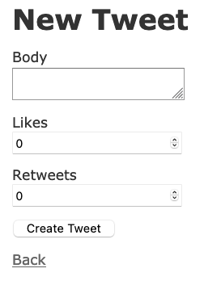
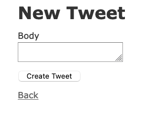
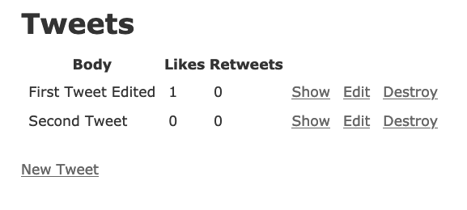
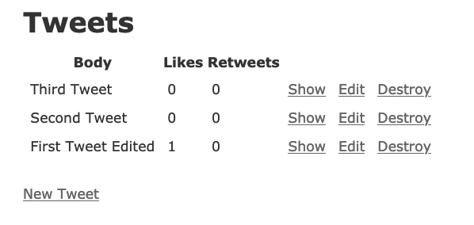
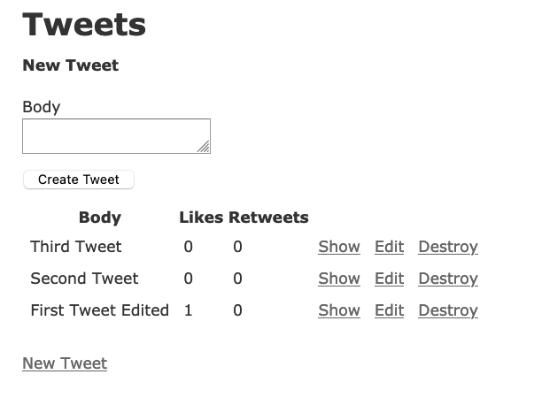
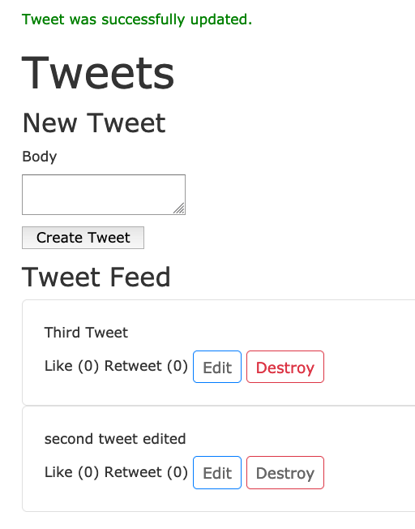
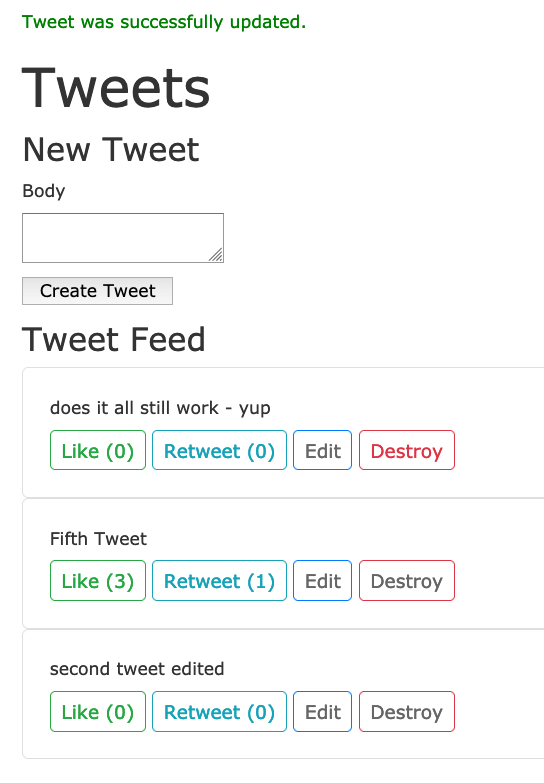

## Overview

This article is just to have a base app that stays on the index page.  We will use this as a starting point for a more efficient single page app by updating this project with Hotwire in the next article [Tweets - A Rails based Single Page App using Hotwire](/post_ruby_rails/rails_6_hotwire_tweet_single_page/)

[Hotwire](https://hotwire.dev/) allows us to build Single Page Apps using Ruby and Rails with nearly NO configuration! It allow very responsive web-applications as it reloads only the parts of the page that change via a socket.  Hotwire using [Turbo](https://turbo.hotwire.dev/) - an evolution of TurboLinks and as such is mobile friendly and in most cases can send the replacement HTML directly from the server to the client with minimal or no client side processing over websockets so there is minimal lag time.

This code can be found at: https://github.com/btihen/tweet_simulator_rails

## Basic Setup

### Create the project

We'll skip Turbolinks since Turbo replaces Turbolinks and also installs Stimulus
```
rails new tweets -d postgresql -T --skip-turbolinks --skip-spring
cd tweets
git add .
git commit -m "initial commit after creation"
```
I generally take a lot of git snapshots (and then squash them - so its easy to go back to a known good point if things don't work out).

### Create a Traditional Rails Tweet Clone

#### Tweet Model

We'll scaffold the model to get all the parts we need

```
bin/rails g scaffold tweet body:text likes:integer retweets:integer
```

We'll update the migration to prevent blanks - make the migration file look like:
```
# db/migrate/yyyymmddHHMMSS_create_tweets.rb
class CreateTweets < ActiveRecord::Migration[6.1]
  def change
    create_table :tweets do |t|
      t.text :body, null: false
      t.integer :likes, null: false, default: 0
      t.integer :retweets, null: false, default: 0

      t.timestamps
    end
  end
end
```

Now we should be able to successfully create and migrate out database
```
bin/rails db:create
bin/rails db:migrate
```

Given the Database restrictions we'll add validations to the model. So now it should look like:
```
# app/models/tweet.rb
class Tweet < ApplicationRecord
  validates :body, presence: true
end
```

Lets also point the root route at our tweets resource - so now it should look like:
```
# config/routes.rb
Rails.application.routes.draw do
  resources :tweets
  root to: "tweets#index"
end
```

Lets start up rails and be sure everything works so far:
```
bin/rails s
```
go to `http://localhost:3000` and make and edit and delete some tweets.

Assuming it works lets commit these changes.
```
git add .
git commit -m "created tweet scaffold, validations and routes"
```

#### Let's make this useable (more like a single page app)

Lets start by fixing the following problems:
1. the create form allows us to choose and edit likes and retweets
2. tweets are listed in the opposite order in oldest to newest
3. to create a new tweet we need to go to a separate new page
3. creating and editing new tweets brings us to a show page (away from our index)
5. message, likes, retweets, etc are all listed in one long table row (we'll fix with some bootstrap css)
6. likes and retweets are not usable


As mentioned users shouldn't choose their likes and retweets:


Now lets remove likes and retweets from our form:
```
# app/views/tweets/_form.html.erb
<%= form_with(model: tweet) do |form| %>
  <% if tweet.errors.any? %>
    <div id="error_explanation">
      <h2><%= pluralize(tweet.errors.count, "error") %> prohibited this tweet from being saved:</h2>

      <ul>
        <% tweet.errors.each do |error| %>
          <li><%= error.full_message %></li>
        <% end %>
      </ul>
    </div>
  <% end %>

  <div class="field">
    <%= form.label :body %>
    <%= form.text_area :body %>
  </div>

  <div class="actions">
    <%= form.submit %>
  </div>
<% end %>
```
Now the form should look like:


If you made several tweets you'll notice that the tweets are in oldest to newest.


We'll fix that with the index controller sort order:
```
# app/controllers/tweets_controller.rb
class TweetsController < ApplicationController
  before_action :set_tweet, only: %i[ show edit update destroy ]

  def index
    @tweets = Tweet.all.order(created_at: :desc)
  end
  ...
end
```


now tweets should be newest to oldest

Let's put our create tweet at the top of our index page
```
# app/views/tweets/index.html.erb
<p id="notice"><%= notice %></p>

<h1>Tweets</h1>

<h4>New Tweet</h4>
<%= render "tweets/form", tweet: @tweet %>

<h4>Tweet Feed</h4>
```
now when we check out index page again -- oops, we get an error:


`errors` is null because the new instance isn't available we need to add a new tweet to our index page from the controller:
```
# app/controllers/tweets_controller.rb
class TweetsController < ApplicationController
  before_action :set_tweet, only: %i[ show edit update destroy ]

  def index
    # put newest tweets at the top of the page
    @tweets = Tweet.all.order(created_at: :desc)
    @tweet = Tweet.new
  end

```
Now when we view index we should be able to create a tweet on the index page:


However, after creation we still go to show page and need to navigate back to the index page - lets fix that in the create controller.  We will change the line:

`format.html { redirect_to @tweet, notice: "Tweet was successfully created." }`

with:

`format.html { redirect_to tweets_url, notice: "Tweet was successfully created." }`

We will have the same problem with update -- so let's fix them both.  Now the controller should look like:
```
# app/controllers/tweets_controller.rb
  def create
    @tweet = Tweet.new(tweet_params)

    respond_to do |format|
      if @tweet.save
        format.html { redirect_to tweets_url, notice: "Tweet was successfully created." }
        format.json { render :show, status: :created, location: @tweet }
      else
        format.html { render :new, status: :unprocessable_entity }
        format.json { render json: @tweet.errors, status: :unprocessable_entity }
      end
    end
  end

  def update
    respond_to do |format|
      if @tweet.update(tweet_params)
        format.html { redirect_to tweet_url, notice: "Tweet was successfully updated." }
        format.json { render :show, status: :ok, location: @tweet }
      else
        format.html { render :edit, status: :unprocessable_entity }
        format.json { render json: @tweet.errors, status: :unprocessable_entity }
      end
    end
  end
```
now after we create a new tweet we should 'stay' (it actually reloads - which could be slow if we had many tweets on the page - we will fix this with hotwire) on the index page and see:


OK we are almost there, but we still have rows of tables and not a nice tweet feed look.

Lets add Bootstrap CSS for some modest beauty (you can copy this file or use the below link to get the newest Bootstrap CSS)
```
# app/views/layout/application.html.erb
<!DOCTYPE html>
<html>

<head>
  <title>Tweets</title>
  <meta name="viewport" content="width=device-width,initial-scale=1">
  <%= csrf_meta_tags %>
  <%= csp_meta_tag %>

  <link rel="stylesheet"
        href="https://cdn.jsdelivr.net/npm/bootstrap@4.6.0/dist/css/bootstrap.min.css"
        integrity="sha384-B0vP5xmATw1+K9KRQjQERJvTumQW0nPEzvF6L/Z6nronJ3oUOFUFpCjEUQouq2+l"
        crossorigin="anonymous">
  <%= stylesheet_link_tag 'application', media: 'all' %>
</head>

<body>
  <%= yield %>
</body>

</html>
```
you can get the newest bootstrap link from: https://getbootstrap.com/docs/ or https://www.bootstrapcdn.com/


Now lets make a partial reformat our feed with bootstrap:
```
# app/views/tweets/_tweet.html.erb
<div class="card card-body">
  <div><%= tweet.body %></div>

  <div class="mt-2">
    <%= "Like (#{tweet.likes})" %>

    <%= "Retweet (#{tweet.retweets})" %>

    <%= link_to 'Edit', edit_tweet_path(tweet),
              class: "btn btn-sm btn-success" %>

    <%= link_to 'Destroy', tweet_path(tweet), method: :delete,
              data: { confirm: 'Are you sure?' },
              class: "btn btn-sm btn-danger" %>
  </div>
</div>
```

Now lets integrate the tweet partial into the index page:
```
# app/views/tweets/index.html.erb
<p id="notice"><%= notice %></p>

<h1>Tweets</h1>

<h4>New Tweet</h4>
<%= render "tweets/form", tweet: @tweet %>

<h4>Tweet Feed</h4>
<%= render @tweets %>
```

We now have an app that basically works from the index pages (not yet Edit, but without Hotwire, that's difficult -- see the next article)



Let's take another git snapshot of 'index' reloading app.
```
git add .
git commit -m "tweet app mostly from the index page"
```

#### Activate likes and retweets

To finish this simple app lets activate Likes and Retweets - we will do this with new controllers since this is an independent action from our tweet itself.  We will use the `create` since we are `creating` a like or a retweet.

Let's build the like controller - we will redirect back to the index where we want to stay:
```
# app/controllers/likes_controller.rb
class LikesController < ApplicationController
  before_action :set_tweet

  def create
    @tweet.increment! :likes
    redirect_to tweets_url
  end

  private

  def set_tweet
    @tweet = Tweet.find(params[:tweet_id])
  end
end
```

And now the retweet controller:
```
# app/controllers/retweets_controller.rb
class RetweetsController < ApplicationController
  before_action :set_tweet

  def create
    @tweet.increment! :retweets
    redirect_to tweets_url
  end

  private

  def set_tweet
    @tweet = Tweet.find(params[:tweet_id])
  end
end
```

These controllers are dependent on the tweet so they are subroutes of a tweet - so lets update our routes to be:
```
# config/routes.rb
Rails.application.routes.draw do
  resources :tweets do
    resource :like, only: [:create]
    resource :retweet, only: [:create]
  end
  root to: "tweets#index"
end
```

Now lets add the connection to controller in our front-end with buttons.  Note we need to use the `method: :post` for our like and retweet `create` because these are normally `posted` by the `edit` form.  In this case we want to bypass a form and just update.
```
# app/views/tweets/_tweet.html.erb
<div class="card card-body">
  <div><%= tweet.body %></div>

  <div class="mt-2">
    <%= link_to "Like (#{tweet.likes})",
                tweet_like_path(tweet),
                method: :post,
                class: "btn btn-sm btn-outline-success" %>

    <%= link_to "Retweet (#{tweet.retweets})",
                tweet_retweet_path(tweet),
                method: :post,
                class: "btn btn-sm btn-outline-info" %>

    <%= link_to 'Edit', edit_tweet_path(tweet),
                class: "btn btn-sm btn-outline-primary" %>

    <%= link_to 'Destroy', tweet_path(tweet), method: :delete,
                data: { confirm: 'Are you sure?' },
                class: "btn btn-sm btn-outline-danger" %>
  </div>
</div>
```
Test that everything works as expected!  Assuming it works - we will take another snapshot.
```
git add .
git commit -m "likes and retweets enabled and also 'stay' on index page"
```

